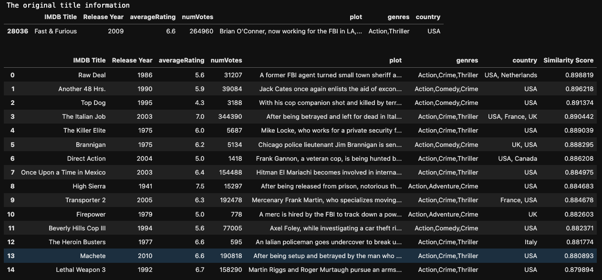
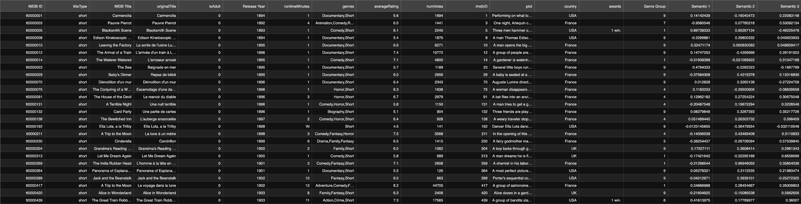

# Movie Recommendation System

**Contributors**
- Sarah Alqaysi
- Hanmaro Song
- Sean Torres

## Objectives

1. ANalyze and Preprocess IMDB data as well as Netflix
2. Use pre-trained Bert model from Hugging Face to analyze the semantics of synopsis for each title
3. Given an input, recommend a list of titles that are similar to the gicen based on genres and plots

## How to Use

In the Modeling.ipynb, do the following.

```python
get_recommendation('Fast & Furious', top_k=top_k, use_genre=False)
```

which will output list of recommendation like



sorted by similarity score in descending order. 

if **use_genre** is set to True, then the model will use both the plot and genre to compute the similarity score. 

## Data Sources

1. [IMDB Movies Analysis](https://www.kaggle.com/datasets/samruddhim/imdb-movies-analysis)
2. [IMDb Dataset - From 1888 to 2023](https://www.kaggle.com/datasets/komalkhetlani/imdb-dataset)
3. [Netflix](https://data.world/alphatango90/netflix-analysis)

## Preprocessed Data Overview



There are total of 768 semantics columns from HuggingFace Bert model ('bert-base-uncased')

## Presentation

[](https://youtu.be/QLjRzXd0voc)


